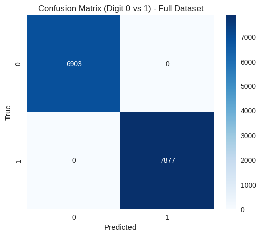

# Machine Learning & Advanced ML Journey @ PUCIT

[](LICENSE)
[](https://www.python.org/)

Implementations, notes, and projects from **CS-567 Machine Learning** and **CS-667 Advanced Machine Learning** taught by **Dr. Nazar Khan** during my MPhil Studies at PUCIT.

## 📚 Topics Covered

### Core Machine Learning (CS-567)
- Probability & Decision Theory
- Curve Fitting, Regularization & Bayesian Perspective
- Linear Regression & Classification
- Maximum Likelihood & MAP Estimation
- Gaussian Mixture Models & EM Algorithm
- Non-parametric Density Estimation
- PCA & Dimensionality Reduction

### Advanced Topics (CS-667)
- Neural Networks & Backpropagation
- Convolutional Neural Networks
- Autoencoders
- Spectral Clustering
- Support Vector Machines
- Boosting
- Mixture Density Networks
- Conditional Mixture Models

## 🚀 Key Projects & Implementations

- **Polynomial Curve Fitting** — Regularized & Bayesian approaches
- **Logistic Regression with IRLS** (Iterative Reweighted Least Squares method) Test Accuracy: 98.49%
- **Gaussian Mixture Models** from scratch + EM
- **PCA** for dimensionality reduction & visualization
- **Neural Nets & CNNs** on MNIST
- **Spectral Clustering** demo
- **Autoencoders** for representation learning

## 🛠️ Tech Stack
- MATLAB & Python
- Python, NumPy, Matplotlib, scikit-learn
- PyTorch / TensorFlow (for deep learning parts)
- Jupyter Notebooks
- MATLAB Files

## 📈 Results Highlights
*(Will add soon screenshots of accuracy tables, confusion matrices, visualizations here; once i upload the implementation)*
- **Polynomial Curve Fitting**

  


- **Logistic Regression with IRLS**
    - Training samples: 12665  -Test samples: 2115 -Using 1500 samples (for speed & memory) - Training finished with 1500 samples. -Test Accuracy: 98.49% on data subset - 100.00% of Full dataset
 
      

## How to Run
```
Use MATLAB
```
```bash
pip install -r requirements.txt
jupyter notebook
```
